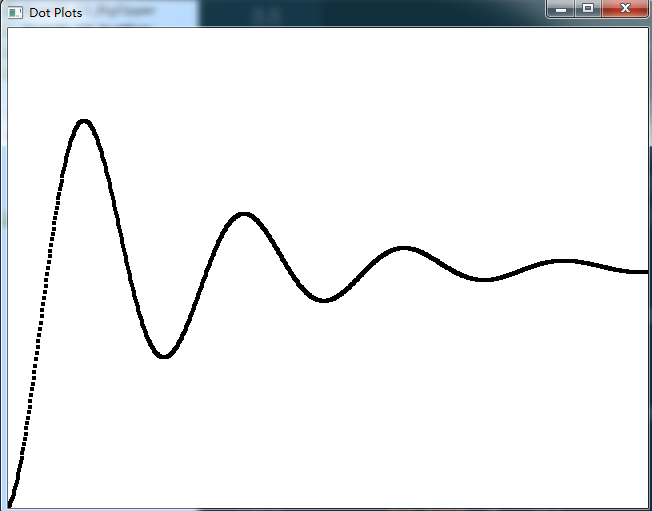

# Description
1. plot the graphic of function f(x) = e-xcos(2πx).
2. the values of x vary between 0 and 4
3. the values of y vary between -1 and 1
4. need to scale the x and y in order to plot in the whole window, so the new x and y can be expressed as sx and sy. And sx = Ax + B; sy = Cy + D. A and C perform scaling, B and D perform shifting.
5. For this dot plots:
- A = screenWidth / 4.0
- B = 0.0
- C = screenHeight / 2.0
- D = C
# Result

