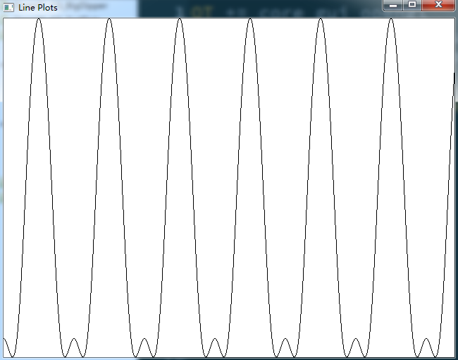

# Description
1. plot the graphic of function:
- f(x) = 300 - 100cos(2πx/100) + 30cos(4πx/100) + 6cos(6πx/100)
2. the values of x vary between 0 and xRange
3. the values of y vary between yMin and yMax
4. need to scale the x and y in order to plot in the whole window, so the new x and y can be expressed as sx and sy. And sx = Ax + B; sy = Cy + D. A and C perform scaling, B and D perform shifting.
5. For this line plots:
- A = screenWidth / xRange
- B = 0.0
- C = screenHeight / yRange
- D = -C * yMin
# Result

