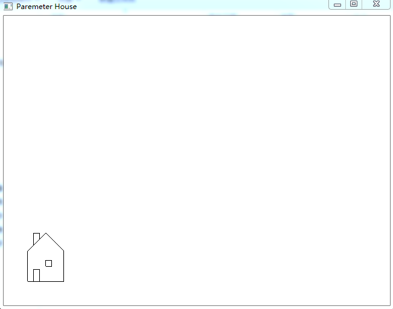
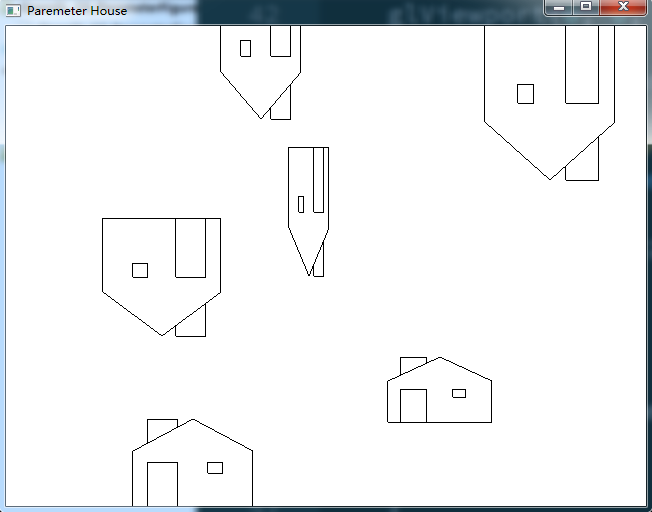

# Description
1. hardwiredHouse(): generate the house with hard-coded positions
2. ParameterHouse: draw the house with parameters and if we want to flip the house, change the direction of width and height
```
        // whether flipped or not
        if(rand() % 2 == 0)
        {
            // even to flip
            width = -width;
            height = -height;
        }
```
# Result
1. hardwiredHouse()


2. ParameterHouse class

