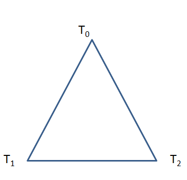
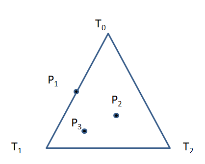
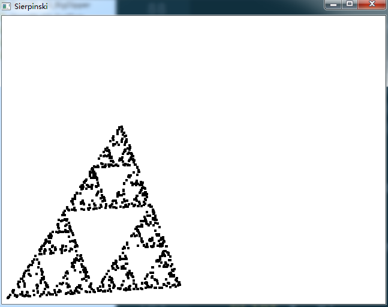

# Description
1. Choose three fixed points T0, T1, and T2 to form some triangle, as shown in the following figure.

2. Choose the inital point P0 to be drawn by selecting one of the points T0, T1, and T2 at random.

Now iterate the following steps until the pattern is satifyingly filled in.

3. Choose one of the three points T0, T1, and T2 at random, call it T.
4. Construct the next point Pk as the midpoint between T and previously found point Pk-1. That is,
$$P_k = midpoint of P_{k-1} and T$$
5. draw Pk

## Example
The following figure shows a few iterations of the foregoing procedure. Suppose the initial point P0 happens to be T0, and let T1 to chosen next. Then P1 is formed so that it lies halfway between T0 and T1. Suppose T2 is chosen next, so that P2 lies between P1 and T2. Next, suppose T1 is chosen again, so that P3 is formed as shown, etc.

# Result

